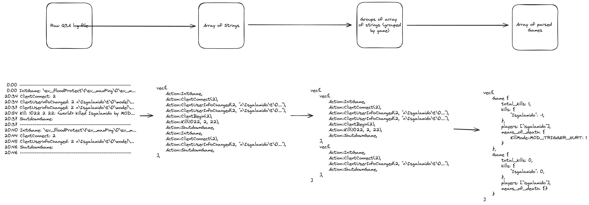

# Quake 3 Arena log parser

This project was created as a challenge to the Cloudwalk senior software engineer position.
It consists of a CLI that parses a quake 3 arena compatible log file and generates reports on each of the games contained.
All the rules to the challenge can be found at the [challenge file](challenge.md). An excerpt from the provided [quake 3 arena log file](input) can be found at [the example file](example) used to test throughout the development.

## Running the project
You can either pass data to it through stdin or through a file read and you can output the results on stdout or to a file.
For that you can use:
`cat ./input | cargo run` to use stdin and stdout as both input and output or you can use the --file and --output parameters to use files.
`cargo run -- --file=input --output=output` will both read from input.txt and write to output.txt

### How the parsing process works
There are 3 main stages of the parser that will run:
1. parse log lines into Actions
2. group actions by game
3. parse grouped actions into games

If the input contains any formatting errors the program should panic and exit with an appropriate message.

## Testing
All unit tests are done through Rust's own testing suite so running `cargo test` should run all tests

## Dependencies
We're using only Serde for json parsing and clap for command line interface parameter handling.
